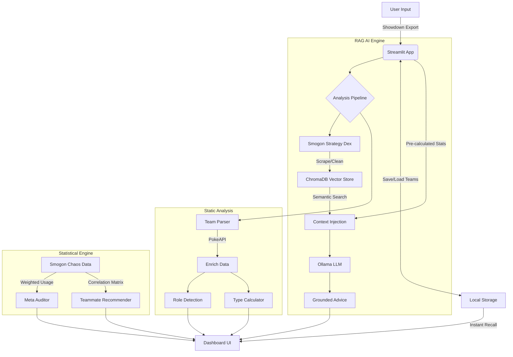

# MetaMatch 

[](https://www.python.org/)
[](https://streamlit.io/)
[](https://ollama.com/)
[](https://opensource.org/licenses/MIT)

**MetaMatch** is a hybrid AI/ML system designed for high-precision competitive Pokémon team analysis. It integrates deterministic mathematical engines with probabilistic Large Language Model (LLM) reasoning, utilizing Retrieval-Augmented Generation (RAG) to ground strategic advice in domain-specific metadata.


## ✨ Features

### 🧠 Smart Analysis Engine
*   **Role Detection:** Automatically identifies 35+ competitive roles (e.g., *Wall, Setup Sweeper, Cleric, Forced Switcher, Stallbreaker*) based on movesets, abilities, items, and stats.
*   **Archetype Engine:** Classifies team strategy (*Hyper Offense, Bulky Offense, Stall, Volt-Turn, Weather, Trick Room*) using detected role distributions.
*   **Deep Logic:** Calculates type weaknesses while respecting **Abilities** and **Items** (e.g., ignores Ground damage for *Levitate* or *Air Balloon* users).
*   **Meta Auditor:** Validates movesets against high-ladder usage stats, flagging statistically suboptimal choices (e.g., using *Shell Bell* when 98% of players use *Rocky Helmet*).
*   **Performance Optimized:** Implements intelligent caching for file I/O and API calls to ensure low-latency responsiveness.

### 🤝 Teammate Recommender
*   **Statistical Synergy:** Suggests optimal teammates based on Smogon "Chaos" correlation matrices from millions of competitive battles.
*   **Team Glue:** Identifies the statistical "glue" Pokemon that best complement your current squad composition using weighted synergy scores.
*   **Real-time Analysis:** Generates data-driven recommendations instantly without relying on LLM processing.

### 🧮 Statistical Engine
MetaMatch processes raw "Chaos" data from Smogon (detailed usage statistics) to power its auditor and recommender systems.
*   **Weighted Usage:** Calculates the exact usage frequency of every Move, Item, and Ability relative to the Pokemon's total appearance rate.
*   **Correlation Matrices:** Utilizes 2D sparse matrices to map teammate synergy scores across the entire metagame.

### 📁 Team Management
*   **Local Persistence:** Save and organize favorite team builds directly to the local filesystem.
*   **Instant Recall:** Instant dashboard loading for analyzed teams, bypassing the full analysis pipeline for previously processed builds.
*   **Modular Storage:** Built with a storage adapter pattern for flexible integration between local JSON and cloud databases.

### 🤖 AI-Powered Coaching (RAG-Enhanced)
MetaMatch implements a sophisticated RAG pipeline to ground LLM reasoning in verified data.
*   **Retrieval-Augmented Generation (RAG):** Uses a **Vector Database (ChromaDB)** to retrieve real-time competitive strategies from Smogon's Strategy Dex, embedded using `all-MiniLM-L6-v2`.
*   **Context-Aware Chat:** Retrieves relevant competitive guides and cross-references them with **exact team data** (Moves, EVs, Nature) to provide grounded advice.
*   **Deterministic Anchoring:** Injects pre-calculated Python-derived "Hard Facts" into the prompt context to eliminate logic hallucinations regarding game mechanics.
*   **Strategic Pilot Guide:** Generates a comprehensive gameplay guide:
    *   **Win Conditions:** Identifies the primary path to victory.
    *   **Lead Options:** Suggests optimal leads based on matchups.
    *   **Key Combos:** Highlights synergies like "Volt-Turn" or defensive cores.

## 💡 Why MetaMatch? (Hybrid AI vs. Generic LLMs)

Generic LLMs "guess" — MetaMatch **calculates**.

| Feature | 🤖 Generic LLMs (ChatGPT/Claude) | ⚪ MetaMatch (RAG Engine) |
| :--- | :--- | :--- |
| **Accuracy** | **Hallucinations:** Often fails simple type math (e.g. ignoring *Levitate*). | **Fact-Anchored:** LLM is provided with hard-coded logic "Ground Truths". |
| **Data Freshness**| **Knowledge Cutoff:** Lacks access to real-time meta shifts. | **Dynamic Retrieval:** Scrapes and embeds the latest Smogon strategies. |
| **Logic Engine** | **Probabilistic:** Estimates matchup advantages. | **Deterministic:** Calculates exact multipliers before AI generation. |
| **Model Efficiency** | **Resource Intensive:** Requires massive frontier models to minimize errors. | **Lightweight:** Optimized for local ~3B models by offloading logic to code. |
| **Workflow** | **Manual Prompting:** Requires constant copy-pasting of team data. | **Seamless Integration:** One-click re-analysis on team changes. |

### 🧪 Real World Examples

#### 1. The "Rotom-Wash" Test
**Scenario:** Weaknesses of a standard **Rotom-Wash** (*Electric/Water* type with *Levitate* ability).
*   **Generic LLM:** "Rotom-Wash is Electric/Water. Electric is weak to Ground. Therefore, **Rotom-Wash is weak to Ground**." ❌ *(Fails to account for Ability)*
*   **MetaMatch:** `Ground: 0.0` (Immune) ✅

#### 2. The "Air Balloon Heatran" Test
**Scenario:** **Heatran** (*Fire/Steel*) holding an **Air Balloon**.
*   **Generic LLM:** Often overlooks the item and flags a **4x Ground weakness**. ❌
*   **MetaMatch:** Correctly identifies the item grants **Ground Immunity** until popped. ✅

---

## 🔄 System Architecture



---

## 🚀 Deployment

### Prerequisites
1.  **Python 3.10+**
2.  **Ollama**:
    *   Install Ollama from [ollama.com](https://ollama.com/).
    *   Pull the model: `ollama pull llama3.2:3b-instruct-q4_K_M`
    *   Start the server: `ollama serve`

### Local Setup

1.  **Clone the Repository:**
    ```bash
    git clone https://github.com/NamikazeAsh/MetaMatch.git
    cd MetaMatch
    ```

2.  **Install Dependencies:**
    ```bash
    pip install -r requirements.txt
    ```
    
3.  **Initialize Data & RAG Index:** (First time setup)
    ```bash
    # Scrape usage stats for Recommender/Auditor
    python src/metamatch/scrapers.py

    # Scrape strategy guides & build Vector DB for AI Coach
    python src/metamatch/rag/build_index.py
    ```

4.  **Launch Application:**
    ```bash
    streamlit run src/metamatch/app.py
    ```

### 🐳 Docker Deployment

1.  **Compose Up:**
    ```bash
    docker-compose up -d
    ```
2.  **Initialize Model:**
    ```bash
    docker exec -it metamatch-ollama ollama pull llama3.2:3b-instruct-q4_K_M
    ```
3.  **Access:** `http://localhost:8501`

---

## 🧪 Quality Assurance

MetaMatch includes a comprehensive test suite to verify the deterministic logic engine. It checks 26+ edge cases including complex dual-type multipliers, ability immunities, and item overrides.

**Execute Tests:**
```bash
python -m unittest src/metamatch/tests/test_mechanics.py
```

---

## 🛠️ Module Overview

*   **`src/metamatch/app.py`**: Streamlit frontend and dashboard orchestration.
*   **`src/metamatch/team.py`**: Core parsing and deterministic calculation engine.
*   **`src/metamatch/suggestions.py`**: LLM orchestration, RAG Context injection, and prompt engineering.
*   **`src/metamatch/rag/`**: Vector database management:
    *   **`scraper.py`**: ETL pipeline for strategy documentation.
    *   **`store.py`**: ChromaDB interface and embedding management.
    *   **`build_index.py`**: Index initialization.
*   **`src/metamatch/recommender.py`**: Statistical synergy calculator.
*   **`src/metamatch/auditor.py`**: Meta-usage validation engine.
*   **`src/metamatch/scrapers.py`**: Smogon Chaos data scraping pipeline.
*   **`src/metamatch/storage.py`**: Data persistence layer.
*   **`src/metamatch/utils.py`**: API caching and text normalization.

---

## 🔮 Limitations & Future Outlook

It's important to acknowledge that the AI landscape is evolving rapidly. As frontier models (like **GPT-5.2**, **Gemini 3**, and beyond) continue to scale, their ability to "simulate" game logic internally will undoubtedly improve.

However, MetaMatch represents a philosophy of **Efficiency & Transparency**:
1.  **Right Tool for the Job:** We shouldn't need a massive frontier model to calculate a Speed stat. Code is perfect for rules; AI is perfect for strategy.
2.  **Privacy:** By optimizing for smaller models (Llama 3B), MetaMatch allows you to keep your strategies local and offline.
3.  **The "Hybrid" Bet:** We believe the future of AI isn't just "bigger models," but "models that know how to use tools." MetaMatch is a proof-of-concept for that future.
4.  **The Persistent Reasoning Gap:** Even with RAG and deterministic anchoring, small-parameter models (3B-8B) face an inherent "reasoning gap" compared to larger frontier models. While MetaMatch minimizes factual hallucinations by offloading math to Python, the model's ability to synthesize high-level strategic nuance remains a persistent constraint of local, small-scale AI.

---

## 🤝 Contributing

Contributions are welcome! Whether it's adding new Role definitions, improving the LLM prompt, or enhancing the UI.

1.  Fork the Project
2.  Create your Feature Branch (`git checkout -b feature/AmazingFeature`)
3.  Commit your Changes (`git commit -m 'Add some AmazingFeature'`)
4.  Push to the Branch (`git push origin feature/AmazingFeature`)
5.  Open a Pull-Review (`git push origin feature/AmazingFeature`)

---

## 🙏 Acknowledgements

*   **[PokeAPI](https://pokeapi.co/)**: Comprehensive Pokémon relational data.
*   **[Smogon University](https://www.smogon.com/)**: Usage statistics and strategy documentation.
*   **[Ollama](https://ollama.com/)**: Local LLM execution framework.
*   **[Streamlit](https://streamlit.io/)**: Data dashboarding framework.