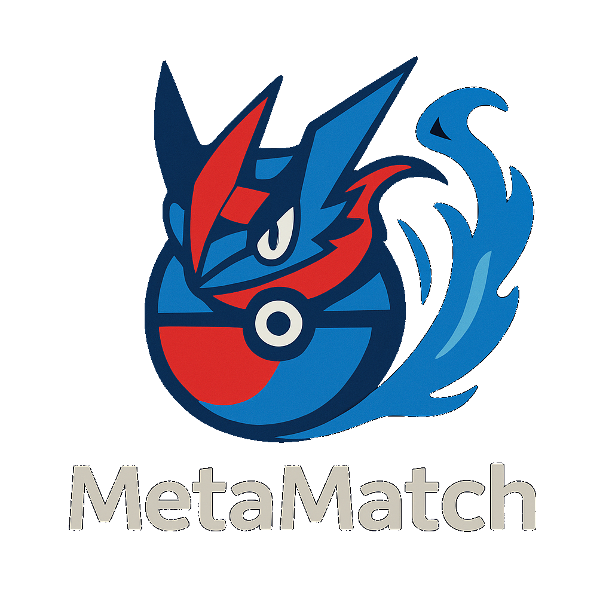

# MetaMatch ⚪

**MetaMatch** is an advanced AI-powered Pokémon team analysis tool. It combines hard-coded competitive logic with Large Language Model (LLM) insights to provide deep feedback on team synergy, weaknesses, and current meta threats.



## ✨ Features

### 🧠 Smart Analysis
*   **Role Detection:** Automatically identifies 30+ competitive roles (e.g., *Wall, Setup Sweeper, Cleric, Hazard Setter*) based on movesets and stats.
*   **Deep Logic:** Calculates type weaknesses while respecting **Abilities** and **Items** (e.g., ignores Ground damage for *Levitate* or *Air Balloon* users).
*   **Meta Integration:** Scrapes live Smogon usage stats to identify top-tier threats relevant to the current season.

### 🤖 AI-Powered Coaching
*   **Local LLM Integration:** Connects to **Ollama** (Llama 3.2) to act as a competitive coach.
*   **Team Synergy:** Provides high-level feedback on your team's archetype (e.g., "Hyper Offense", "Stall").
*   **Threat Hunter:** Identifies specific meta counters to your team and suggests counter-strategies.
*   **Detailed Tips:** Gives per-Pokemon advice (e.g., "Swap Leftovers for Heavy-Duty Boots on Volcarona").

### 📊 Modern Dashboard
*   **Trading Card UI:** Visualizes your team as a grid of detailed cards with Sprites, Types, and Roles.
*   **At-a-Glance Metrics:** A top-bar dashboard shows Team Archetype, Coverage, and Critical Weaknesses.
*   **Defensive & Offensive Heatmaps:** Instantly see your team's type vulnerabilities and coverage gaps in color-coded matrices.
*   **Speed Tier Chart:** A visual plot comparing your team's speed against live meta benchmarks.
*   **Debug Presets:** Instantly load "Balanced", "Rain", or "Stall" teams to test the analyzer.

---

## 💡 Why MetaMatch? (vs. Generic LLMs)

Why not just ask ChatGPT? Because generic LLMs "guess" — MetaMatch **calculates**.

| Feature | 🤖 Generic LLMs (ChatGPT/Claude) | ⚪ MetaMatch |
| :--- | :--- | :--- |
| **Accuracy** | **Hallucinations:** Can fail simple type math (e.g., ignoring *Levitate*). | **Hard Logic:** Deterministic type calculator respecting Abilities & Items. |
| **Data Freshness**| **Cutoff Dates:** Doesn't know this month's usage stats. | **Live Meta:** Scrapes Smogon stats *on demand* for real-time relevance. |
| **Hybrid Engine** | **Text Only:** Generates plausible-sounding but often mathematically flawed advice. | **Math + AI:** Uses code for 100% accurate stats/weaknesses, and AI for high-level strategy. |
| **Workflow** | **Slow Prompting:** "Here is my new team..." (copy-paste-repeat). | **Rapid Iteration:** Tweak one move in the sidebar -> Instant re-analysis. |

---

## 🚀 Getting Started

### Prerequisites
1.  **Python 3.10+**
2.  **Ollama** (for AI features):
    *   Install Ollama from [ollama.com](https://ollama.com/).
    *   Pull the model: `ollama pull llama3.2:3b-instruct-q4_K_M`
    *   Start the server: `ollama serve`

### Installation

1.  **Clone the Repository:**
    ```bash
    git clone https://github.com/NamikazeAsh/MetaMatch.git
    cd MetaMatch
    ```

2.  **Install Dependencies:**
    ```bash
    pip install -r requirements.txt
    ```
    
3.  **Generate Meta Data:** (First time setup)
    ```bash
    python smogon_scrape.py
    ```

4.  **Run the App:**
    ```bash
    streamlit run app.py
    ```

---

## 🛠️ Architecture

*   **`app.py`**: The Streamlit frontend. Handles the Sidebar input, Dashboard rendering, and state management.
*   **`team_read.py`**: The "Static Analyzer." Parses Showdown text, calculates real stats (including speed), and detects roles.
*   **`suggestion_call.py`**: The "AI Brain." Queries a local LLM for qualitative advice.
*   **`smogon_scrape.py`**: The "Meta Crawler." Downloads Smogon stats and generates meta benchmarks (top threats, speed tiers).
*   **`helper.py`**: Centralizes API calls with a persistent `api_cache.json` to reduce redundant requests.
*   **`type_chart.py`**: Provides a static, offline type-effectiveness chart for instant matrix calculations.
*   **`jsons/`**: Stores cached data (`api_cache`, `meta_speeds`) and meta lists (`topPoke`).

---

## 📝 Usage

1.  **Paste Team:** Copy your team export from [Pokémon Showdown](https://play.pokemonshowdown.com/teambuilder).
2.  **Input:** Paste it into the Sidebar text area.
3.  **Analyze:** Click "Analyze Team".
4.  **Review:**
    *   Check the **Dashboard** for major red flags.
    *   View **Suggestions** for specific move/item tweaks.
    *   View the **Matrices** to find your defensive holes and offensive blind spots.
    *   Check **Speed Tiers** to see what outspeeds you.

---

## 🤝 Contributing

Contributions are welcome! Whether it's adding new Role definitions, improving the LLM prompt, or enhancing the UI.

1.  Fork the Project
2.  Create your Feature Branch (`git checkout -b feature/AmazingFeature`)
3.  Commit your Changes (`git commit -m 'Add some AmazingFeature'`)
4.  Push to the Branch (`git push origin feature/AmazingFeature`)
5.  Open a Pull Request