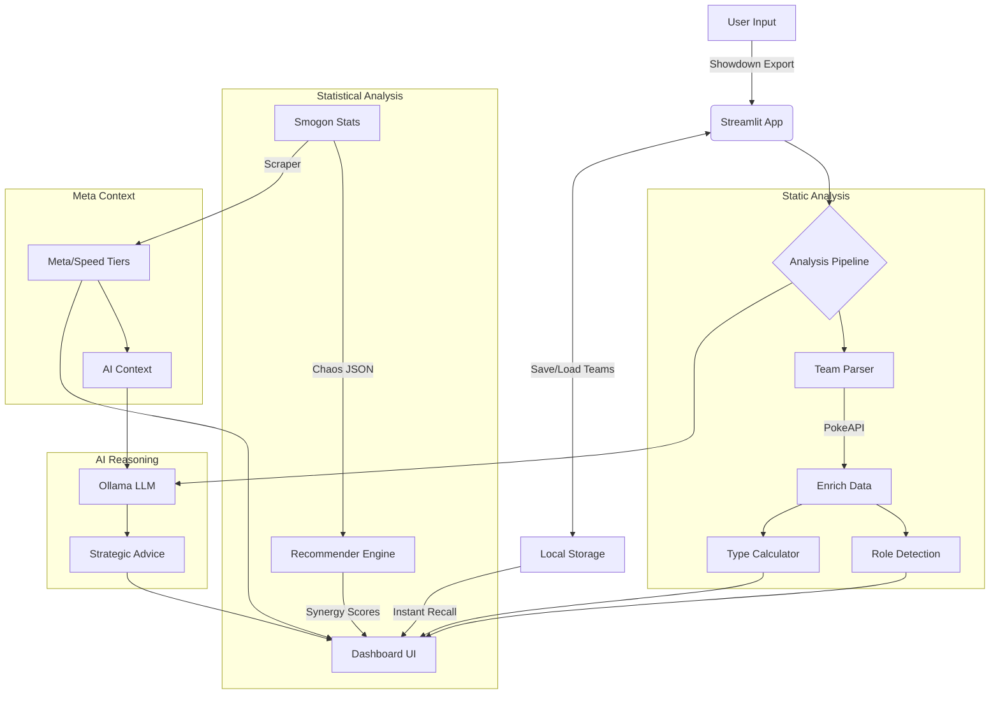

# MetaMatch 

[](https://www.python.org/)
[](https://streamlit.io/)
[](https://ollama.com/)
[](https://opensource.org/licenses/MIT)

**MetaMatch** is an advanced AI-powered Pokémon team analysis tool wrapped in a futuristic, neon-glassmorphism dashboard. It combines hard-coded competitive logic with Large Language Model (LLM) insights to provide deep feedback on team synergy, weaknesses, and current meta threats.


## ✨ Features

### 🧠 Smart Analysis
*   **Role Detection:** Automatically identifies 35+ competitive roles (e.g., *Wall, Setup Sweeper, Cleric, Forced Switcher, Stallbreaker*) based on movesets, abilities, items, and stats.
*   **Archetype Engine:** Classifies your team's high-level strategy (*Hyper Offense, Bulky Offense, Stall, Volt-Turn, Weather, Trick Room*) based on detected roles.
*   **Deep Logic:** Calculates type weaknesses while respecting **Abilities** and **Items** (e.g., ignores Ground damage for *Levitate* or *Air Balloon* users).
*   **Smart Caching:** High-performance analysis with persistent caching for Move Metadata and Type Interactions, ensuring instant results on subsequent runs.
*   **Meta Integration:** Scrapes live Smogon usage stats to identify top-tier threats relevant to the current season.
*   **Meta Auditor:** Validates movesets against high-ladder usage stats, flagging statistically suboptimal choices (e.g., using *Shell Bell* when 98% of players use *Rocky Helmet*).

### 🤝 Teammate Recommender
*   **Statistical Synergy:** Suggests optimal teammates based on Smogon "Chaos" correlation matrices from millions of competitive battles.
*   **Team Glue:** Identifies the statistical "glue" Pokemon that best complement your current squad composition.
*   **Real-time Analysis:** Generates data-driven recommendations instantly without relying on LLM processing.

### 🧮 Statistical Engine
MetaMatch processes raw "Chaos" data from Smogon (detailed usage statistics) to power its auditor and recommender systems.
*   **Weighted Usage:** Calculates the exact usage frequency of every Move, Item, and Ability relative to the Pokemon's total appearance rate.
*   **Correlation Matrices:** Utilizes 2D sparse matrices to map teammate synergy scores across the entire metagame.

### 📁 Team Management
*   **Local Persistence:** Save and organize favorite team builds directly to the local filesystem.
*   **Instant Recall:** Instant dashboard loading for analyzed teams, bypassing the full analysis pipeline for previously processed builds.
*   **Modular Storage:** Built with a storage adapter pattern for flexible integration between local JSON and cloud databases.

### 🤖 AI-Powered Coaching
*   **Local LLM Integration:** Connects to **Ollama** (Llama 3.2) to act as a competitive coach.
*   **Strategic Pilot Guide:** Generates a comprehensive gameplay guide for your specific team:
    *   **Win Conditions:** Identifies your primary path to victory.
    *   **Lead Options:** Suggests optimal leads based on matchups.
    *   **Key Combos:** Highlights synergies like "Volt-Turn" or defensive cores.
*   **Context-Aware Advice:** The AI receives a cleaned, stat-rich dataset (Base Stats, Real Speed) to prevent hallucinations and provide grounded advice.
*   **Threat Hunter:** Identifies specific meta counters to your team and suggests counter-strategies.

### 📊 Futuristic 2026 Dashboard
*   **Neon Glassmorphism:** A premium UI featuring semi-transparent surfaces, `backdrop-filter` blurs, and high-fidelity typography.
*   **Dynamic Neon Glow:** Pokémon cards feature unique outer glows that match their primary type color.
*   **Micro-Animations:** Fluid entrance animations and glowing, pulsing interactive elements for a "living" HUD experience.
*   **At-a-Glance Metrics:** Glowing dashboard tiles for Team Archetype, Type Coverage, and Critical Weaknesses.
*   **Heatmaps & Speed Tiers:** Visualized data via glowing matrices and interactive Altair speed charts.

---

## 💡 Why MetaMatch? (vs. Generic LLMs)

Why not just ask ChatGPT? Because generic LLMs "guess" — MetaMatch **calculates**.

| Feature | 🤖 Generic LLMs (ChatGPT/Claude) | ⚪ MetaMatch |
| :--- | :--- | :--- |
| **Accuracy** | **Hallucinations:** Can fail simple type math (e.g., ignoring *Levitate*). | **Hard Logic:** Deterministic type calculator respecting Abilities & Items. |
| **Data Freshness**| **Cutoff Dates:** Doesn't know this month's usage stats. | **Live Meta:** Scrapes Smogon stats *on demand* for real-time relevance. |
| **Hybrid Engine** | **Text Only:** Generates plausible-sounding but often mathematically flawed advice. | **Math + AI:** Uses code for 100% accurate stats/weaknesses, and AI for high-level strategy. |
| **Model Efficiency** | **Massive:** Needs massive frontier models (**GPT-5.2**) to minimize hallucinations. | **Lightweight:** Works perfectly with a tiny ~3B model (Llama 3.2) because logic is offloaded to code. |
| **Workflow** | **Slow Prompting:** "Here is my new team..." (copy-paste-repeat). | **Rapid Iteration:** Tweak one move in the sidebar -> Instant re-analysis. |

### 🧪 Real World Examples

#### 1. The "Rotom-Wash" Test
**Scenario:** You ask for the weaknesses of a standard **Rotom-Wash** (*Electric/Water* type with *Levitate* ability).
*   **Generic LLM:** "Rotom-Wash is Electric/Water. Electric is weak to Ground. Therefore, **Rotom-Wash is weak to Ground**." ❌ *(Fails to account for Ability)*
*   **MetaMatch:** `Ground: 0.0` (Immune) ✅

#### 2. The "Air Balloon Heatran" Test
**Scenario:** You have a **Heatran** (*Fire/Steel*) holding an **Air Balloon**.
*   **Generic LLM:** Often overlooks the item and flags a **4x Ground weakness**. ❌
*   **MetaMatch:** Correctly identifies the item grants **Ground Immunity** until popped. ✅

---

## 🔄 How It Works



---

## 🚀 Getting Started

### Prerequisites
1.  **Python 3.10+**
2.  **Ollama** (for AI features):
    *   Install Ollama from [ollama.com](https://ollama.com/).
    *   Pull the model: `ollama pull llama3.2:3b-instruct-q4_K_M`
    *   Start the server: `ollama serve`

### Installation

1.  **Clone the Repository:**
    ```bash
    git clone https://github.com/NamikazeAsh/MetaMatch.git
    cd MetaMatch
    ```

2.  **Install Dependencies:**
    ```bash
    pip install -r requirements.txt
    ```
    
3.  **Generate Meta Data:** (First time setup)
    ```bash
    python src/metamatch/scrapers.py
    ```

4.  **Run the App:**
    ```bash
    streamlit run src/metamatch/app.py
    ```

### 🐳 Docker Quickstart (No Python Needed)

1.  **Run the App:**
    ```bash
    docker-compose up -d
    ```
2.  **Pull the Model:** (One time only)
    ```bash
    docker exec -it metamatch-ollama ollama pull llama3.2:3b-instruct-q4_K_M
    ```
3.  **Open:** Go to `http://localhost:8501`

---

## 🧪 Quality Assurance (Testing)

MetaMatch includes a comprehensive test suite to verify the "Hard Logic" engine. It checks 26+ edge cases including complex dual-type multipliers, ability immunities, and item overrides.

**Run the tests:**
```bash
python -m unittest src/metamatch/tests/test_mechanics.py
```

---

## 🛠️ Architecture

*   **`src/metamatch/app.py`**: The Streamlit frontend and dashboard.
*   **`src/metamatch/team.py`**: Core logic for parsing teams and calculating stats/weaknesses.
*   **`src/metamatch/suggestions.py`**: LLM integration and strategic advice generator.
*   **`src/metamatch/recommender.py`**: Statistical engine for calculating teammate synergy scores.
*   **`src/metamatch/auditor.py`**: Statistical engine for validating sets against meta usage trends.
*   **`src/metamatch/scrapers.py`**: Smogon usage stats scraper (supports Chaos data).
*   **`src/metamatch/storage.py`**: Local persistence adapter for saving and loading teams.
*   **`src/metamatch/utils.py`**: Shared utilities and API caching.
*   **`src/metamatch/config.py`**: Centralized path and environment configuration.
*   **`data/`**: Persistent storage for JSON caches and raw stats.
*   **`assets/`**: Static image assets and logos.

---

## 🔮 Limitations & Future Outlook

It's important to acknowledge that the AI landscape is evolving rapidly. As frontier models (like **GPT-5.2**, **Gemini 3**, and beyond) continue to scale, their ability to "simulate" game logic internally will undoubtedly improve.

However, MetaMatch represents a philosophy of **Efficiency & Transparency**:
1.  **Right Tool for the Job:** We shouldn't need a massive frontier model to calculate a Speed stat. Code is perfect for rules; AI is perfect for strategy.
2.  **Privacy:** By optimizing for smaller models (Llama 3B), MetaMatch allows you to keep your strategies local and offline.
3.  **The "Hybrid" Bet:** We believe the future of AI isn't just "bigger models," but "models that know how to use tools." MetaMatch is a proof-of-concept for that future.

---

## 🤝 Contributing

Contributions are welcome! Whether it's adding new Role definitions, improving the LLM prompt, or enhancing the UI.

1.  Fork the Project
2.  Create your Feature Branch (`git checkout -b feature/AmazingFeature`)
3.  Commit your Changes (`git commit -m 'Add some AmazingFeature'`)
4.  Push to the Branch (`git push origin feature/AmazingFeature`)
5.  Open a Pull-Review (`git push origin feature/AmazingFeature`)

---

## 🙏 Acknowledgements

MetaMatch is built upon the incredible work of the Pokémon community:

*   **[PokeAPI](https://pokeapi.co/)**: For providing the comprehensive database of Pokémon, types, and moves.
*   **[Smogon University](https://www.smogon.com/)**: For the competitive usage stats that power our meta-analysis.
*   **[Ollama](https://ollama.com/)**: For enabling local LLM execution, keeping analysis private and fast.
*   **[Streamlit](https://streamlit.io/)**: For the framework that makes building this dashboard a breeze.