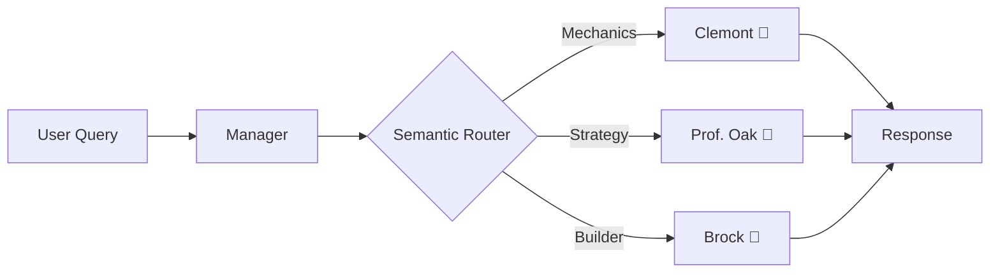

# Multi-Agent System (MAS) 🧠

This directory contains the autonomous agents that power MetaMatch's analysis capabilities. The system uses a **Router-Manager** architecture to classify user intent and delegate execution to the most appropriate specialist agent.

## 🏗️ Architecture

The entry point is `Manager`, which acts as the orchestrator. It uses the `Router` to analyze the query's semantic intent and dispatches it to one of three specialized agents.



## 🤖 The Agents

| Agent | Persona | Role | Logic Type | Temperature | File |
| :--- | :--- | :--- | :--- | :--- | :--- |
| **Tactician** | **Clemont** 🧪 | Game Mechanics & Math | **Deterministic** | `0.0` | `tactician.py` |
| **Coach** | **Prof. Oak** 📜 | Strategy & Win Conditions | **Probabilistic (RAG)** | `0.4` | `coach.py` |
| **Auditor** | **Brock** 🍳 | Usage Stats & Meta Checks | **Statistical** | `0.2` | `auditor.py` |

### 1. Tactician (`tactician.py`)
*   **Goal:** Provide hard facts without hallucination.
*   **Method:** Intercepts queries about type matchups, damage, speed tiers, and ability interactions. It resolves these using Python logic (e.g., `type_chart.py`) and injects the *result* into the prompt, forcing the LLM to just format the answer rather than calculate it.
*   **Example:** *"Is Rotom-Wash weak to Ground?"* -> Calculates `Ground vs Levitate = 0` -> Returns "No, it is immune."

### 2. Coach (`coach.py`)
*   **Goal:** Explain *how* to win.
*   **Method:** Uses **RAG (Retrieval-Augmented Generation)** to fetch strategy guides from ChromaDB. It combines these guides with the user's specific team context to offer tailored advice.
*   **Example:** *"How do I beat Stall?"* -> Retrieves "Stallbreaking Guide" -> Suggests moves based on the user's current team.

### 3. Auditor (`auditor.py`)
*   **Goal:** Validate builds against the "Meta".
*   **Method:** Queries the `metamatch/auditor.py` statistical engine (powered by Smogon Chaos data) to check if moves/items are standard.
*   **Example:** *"Is Shell Bell good on Heatran?"* -> Checks usage stats -> "No, 98% use Leftovers. Shell Bell usage is <0.1%."

## 🛣️ Routing Logic (`router.py`)

The router uses `sentence-transformers/all-MiniLM-L6-v2` to generate embeddings for the user's query. It compares this vector against pre-computed "anchor phrases" for each intent.

*   **Mechanics Anchors:** "damage calc", "outspeed", "weakness", "interaction"
*   **Strategy Anchors:** "win condition", "how to play", "counter", "guide"
*   **Builder Anchors:** "moveset", "ev spread", "item", "synergy"

## 💻 Usage

```python
from metamatch.agents import AgentManager

manager = AgentManager()

# The manager handles routing internally
response_stream = manager.get_response(
    query="How do I use this team?", 
    team_context={...}, 
    team_weakness={...}
)

for chunk in response_stream:
    print(chunk, end="")
```
